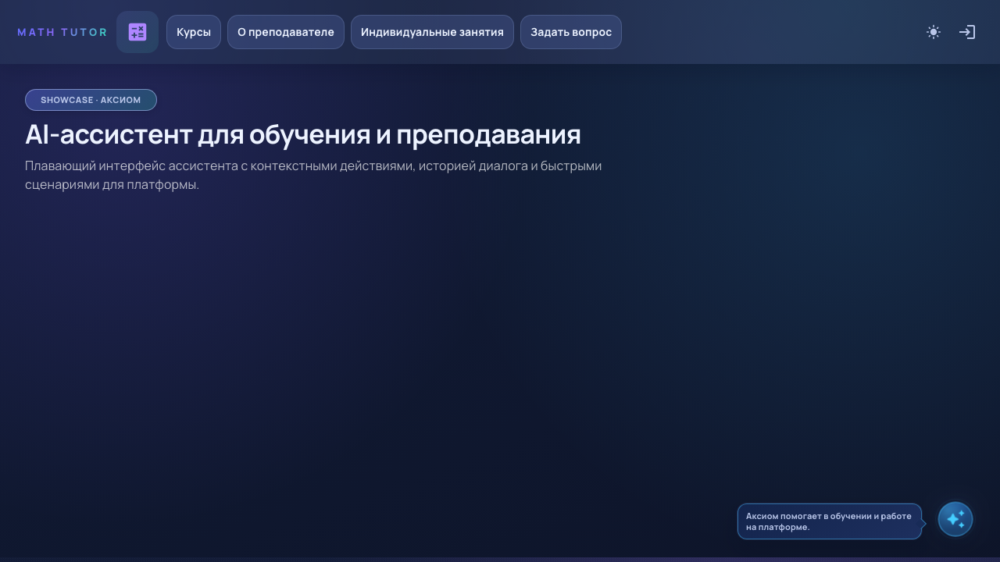
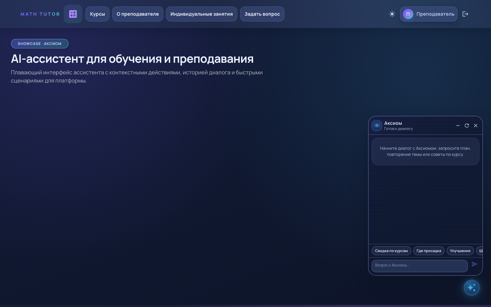

# Axiom Assistant Demo

Демо-витрина ассистента Аксиом: интерфейс, сценарии взаимодействия и интеграция в учебный кабинет.

## Скриншоты



## Что показано
- Плавающий launcher ассистента.
- Чат-окно ассистента с состояниями.
- Быстрые сценарии подсказок и действий.
- Интеграция в teacher/student страницы.
- Подготовка к подключению внешнего AI-провайдера.

## Стек
- React + TypeScript + Vite
- MUI
- feature-based архитектура

## Быстрый старт
```bash
npm install
npm run dev:showcase
```

Откроется маршрут: `/axiom-demo` (если браузер не открылся автоматически: [http://localhost:5173/axiom-demo](http://localhost:5173/axiom-demo)).

## Демо-доступ
- Учитель: `teacher@axiom.demo` / `magic`
- Студент: `student@axiom.demo` / `magic`

## Что оценивать на собеседовании
- Сложный UI/UX ассистента и качество состояний.
- Адаптивность light/dark.
- Подготовка к будущей LLM-интеграции.

## Ограничения
- Детерминированные ответы в mock-режиме.
- Без внешних AI API в этой витрине.
